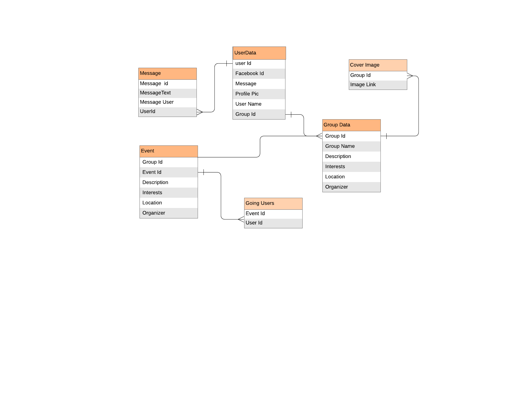
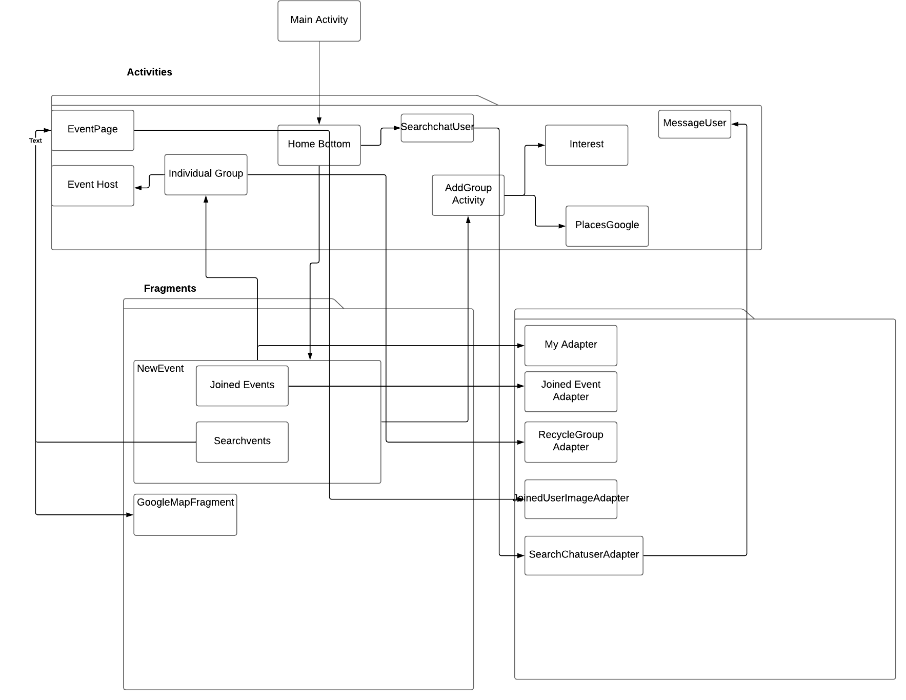
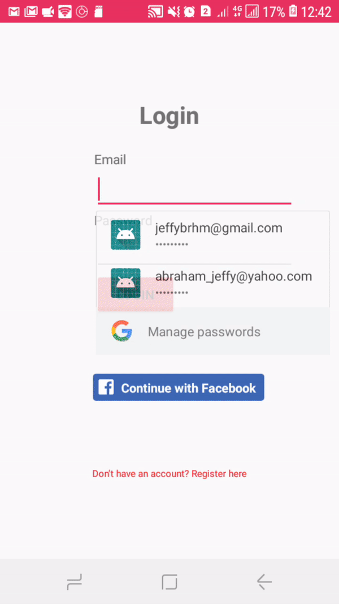

# Mobile Application Development Assignment

Name : Jeffy Abraham

# Meru 

## Overview
This is a Socail networking application developed using android studio with Firebase Realtime database as the backend.

  * User Signup and login with firebase and Facebook profile
  * Bottom Nav drawer
  * Users can upload their profile picture
  * Users can create groups by using features like google places autocomplete
  * Users can join the event if they are  a member of the group
  * See the location of event on Map(Google Maps Api)
  * Private and public views .i.e only group administartor has the permission to host event within that group
  * Group Adminstartor can update the cover picture of a group
  * Search for events and other users (Real time search using Algolia)
  * Chat with other users

  


### Data Model



### Architecture




### Application UI Design and Main Features

* #### Authentication
  ##### Signup:
  
  when the app first launches its shows the Log in screen , if the user dosent have an account he can register himself.The signup is done using FireBase Auth.The user can provide his email address and password once it has been provided user can upload his profile picture .The profile picture is stored in Firebase storage and the link to it is stored in field Userdata feild with in the Firebase Database
   ##### Login:
   For the purpose of Log in user have 2 option either use Facebook Login or login with the password and email address used while signing in .When the user login is successful the profile image of the user along with all the necessary data is loaded and displayed in the home screen
  
 * ##### UI Components:
   ###### Bottom Nav Drawer:
   The Homepage features bottom Nav drawer which has some set of icons like searchbutton,Messagebutton,Home button.Each of these button has corresponding activies and fragments attach to it.The bottom nav provides easy switching among components
   ###### HomePageUI:
   In home page for displaying various groups a cardview along with recylerview is implemented with in a Fragment.The recylerview implemented is a horizontal recyclerview.The recyler view has an action listner attached to it such that when ever a user clicks on it will take him to the Group page.
   Th Home page also has Bottom  Tabbed activity, within the tabbed activities are list of all the events joined by the users
   ###### AddGroupUI:
   The add group UI has different fields on to which users can enter the group name, Description and a grid recycler view help of which users can tag the  interest or the main theme of the group
   Group page has a group cover image ,Buttons for uploading the cover image,Horizontal recycler view which displays list of all the events particular group,Location of the group and the organizer.
   It also has a spinner which on click allows the users to host an event
   ###### GroupPageUI:
   Group page has a group cover image ,Buttons for uploading the cover image,Horizontal recycler view which displays list of all the events particular group,Location of the group and the organizer.
   It also has a spinner which on click allows the users to host an event.
   ###### HostEventUI:
   The host event UI has textboxes which allows users to set date ,have an event name, and a Google places autocomplete.
   ##### SearchUI:
   when the user clicks the search button it opens up an activity it displays all the events available and users can click on it to join
   that event(Explain further in main featurs)
   ##### MessageUI:
   The message Ui displays list of Users available .The current user can click on the user to whom he want to chat which opens up the chatbox
   
   
  
  

### Break down into end to end tests

Explain what these tests test and why

```
Give an example
```

### And coding style tests

Explain what these tests test and why

```
Give an example
```

## Deployment

Add additional notes about how to deploy this on a live system

## Built With

* [Dropwizard](http://www.dropwizard.io/1.0.2/docs/) - The web framework used
* [Maven](https://maven.apache.org/) - Dependency Management
* [ROME](https://rometools.github.io/rome/) - Used to generate RSS Feeds

## Contributing

Please read [CONTRIBUTING.md](https://gist.github.com/PurpleBooth/b24679402957c63ec426) for details on our code of conduct, and the process for submitting pull requests to us.

## Versioning

We use [SemVer](http://semver.org/) for versioning. For the versions available, see the [tags on this repository](https://github.com/your/project/tags). 

## Authors

* **Billie Thompson** - *Initial work* - [PurpleBooth](https://github.com/PurpleBooth)

See also the list of [contributors](https://github.com/your/project/contributors) who participated in this project.

## License

This project is licensed under the MIT License - see the [LICENSE.md](LICENSE.md) file for details

## Acknowledgments

* Hat tip to anyone whose code was used
* Inspiration
* etc
