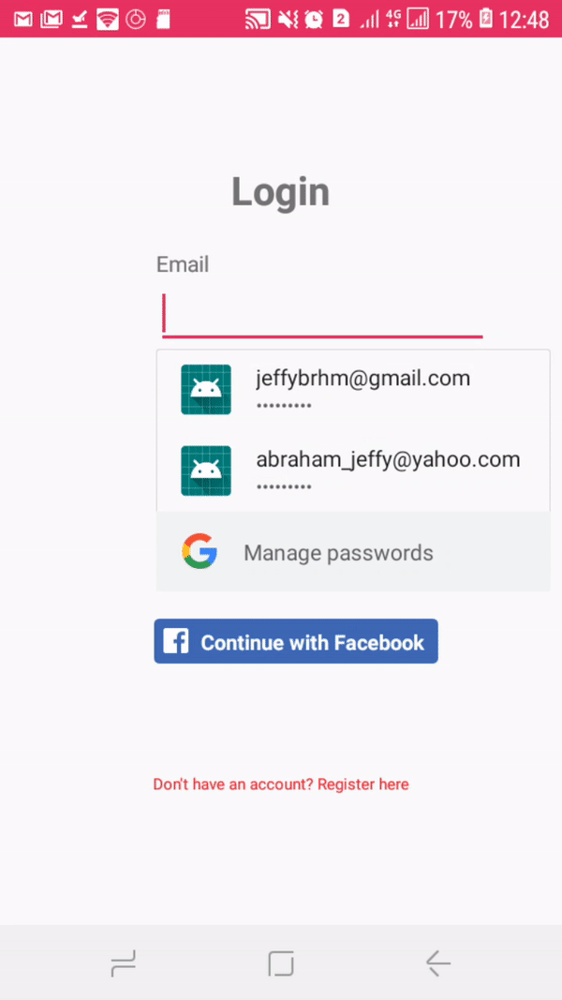

# Mobile Application Development Assignment

Name : Jeffy Abraham

# Meru 

## Overview
A Social networking application developed using android studio with Firebase Realtime database as the backend.
Some of the features of this app are

  * User Signup and login with firebase and Facebook profile
  * Bottom Nav drawer
  * Users can upload their profile picture
  * Users can create groups by using features like google places autocomplete
  * Users can join the event if they are  a member of the group
  * See the location of event on Map(Google Maps Api)
  * Private and public views .i.e only group administrator has the permission to host event within that group
  * Group Administrator can update the cover picture of a group
  * Search for events and other users (Real time search using Algolia)
  * Chat with other users

  


### Data Model


### Architecture


### Application UI Design and Main Features

* #### Authentication
  #### Signup:
  
 
  
  
  
  when the app first launches it shows the Log in screen , if the user doesn't have an account he can register himself.The signup is done using FireBase Auth.The user can provide his email address and password once it has been provided user can upload his profile picture .The profile picture is stored in Firebase storage and the link to it is stored in field Userdata field with in the Firebase Database
   #### Login:
   
   
   For the purpose of Log in user have 2 option either use Facebook Login or login with the password and email address used while registering.When the user login is successful the profile image of the user along with all the necessary data is loaded and displayed in the home screen
  
 * ##### UI Components:
   #### Bottom Nav Drawer:
   
   
   The Homepage features bottom Nav drawer which has some set of icons like search button,Message Button,Home button.Each of these buttons have corresponding activities and fragments attach to it.The bottom nav provides easy switching among components
   #### HomePageUI:
   
   
   In home page for displaying various groups a cardview along with recyclerview is implemented with in a Fragment.The recylerview implemented is a horizontal recyclerview.The recyclerview has an action listener attached to it such that when ever a user clicks on it will take him to the Group page.
   The Home page also has Bottom  Tabbed activity, within the tabbed activities are list of all the events joined by the users
   #### AddGroupUI:
   
    
   The add group UI has different fields on to which users can enter the group name, Description and a grid recycler view help of which users can tag the  interest or the main theme of the group
   Group page has a group cover image ,Buttons for uploading the cover image,Horizontal recyclerview which displays list of all the events particular group,Location of the group and the organizer.
   It also has a spinner which on click allows the users to host an event
   
   #### GroupPageUI:
   
    
   Group page has a group cover image ,Buttons for uploading the cover image,Horizontal recyclerview which displays list of all the events particular group,Location of the group and the organizer.
   It also has a spinner which on click allows the users to host an event.
   
   #### HostEventUI:
   
    
  
   The host event UI has textboxes which allows users to set date ,have an event name, and a Google places autocomplete.
   
   #### SearchUI:
   
    
   when the user clicks the search button it opens up an activity it displays all the events available and users can click on it to join
   that event(Explain further in main features)
   
   #### MessageUI:
   
   
  
   The message Ui displays list of Users available .The current user can click on the user to whom he want to chat which opens up the chatbox
   
   


### Main Functionalities

* #### Private and protected view:

Only the group admin can change the Group cover image and host events.If a user who is not a member of the group tries to join an event then he may to join the group first to have access to the event.


* #### Use of Algolia Search:

Since search in firebase doesn't happen in real time  .This may be true if there are few users using your app but if your app has many users algolia instant search can be used where searching happens in real time.
For eg whenever a user is created a copy of the user data gets stored in Algolia Database and with the help of algolia dependency along with recycler view the search data can be retrieved and displayed respectively.

* #### Use of Google Places Auto complete:

Google places Auto complete has been used to search for auto completion of locations

* #### Use of Google Maps API:

Google Maps api has been used to show the location where the event has been hosted

* #### Firebase Storage

Firebase storage is used to store Images and retrieve them.Profile pictures and Group Cover Images are stored in it.

* #### Chat Feature
 
 Users can chat with each other .This feature is implemented with the help of firebase databases On child added function
 
 * #### Facebook API
 
 Facebook API is used for facebook Authentication.It is also used for retrieving the Facebook profile picture of the user


### Dependencies Used
    implementation 'com.firebaseui:firebase-ui-database:5.0.0'
    implementation 'com.google.android.material:material:1.0.0-rc01'
    implementation 'androidx.appcompat:appcompat:1.0.2'
    implementation 'de.hdodenhof:circleimageview:3.0.0'
    implementation 'com.algolia:algoliasearch-android:3.+'
    implementation 'androidx.recyclerview:recyclerview:1.0.0'
    implementation 'com.github.hani-momanii:SuperNova-Emoji:1.1'
    implementation 'com.android.support:recyclerview-v7'
    implementation 'com.google.android.libraries.places:places:2.0.0'
    implementation 'com.squareup.picasso:picasso:2.71828'
    implementation 'com.google.android.material:material:1.0.0-rc01'
    implementation 'androidx.constraintlayout:constraintlayout:1.1.3'
    implementation 'com.facebook.android:facebook-login:[5,6)'
    implementation 'com.google.firebase:firebase-database:18.0.0'
    implementation 'com.github.lguipeng:BubbleView:1.0.1'
    implementation 'com.google.firebase:firebase-auth:18.1.0'
    implementation 'androidx.legacy:legacy-support-v4:1.0.0'
    implementation 'com.google.firebase:firebase-storage:18.1.1'
    implementation 'androidx.lifecycle:lifecycle-extensions:2.0.0'
    implementation 'com.google.maps.android:android-maps-utils:0.5'


```
Give an example
```

